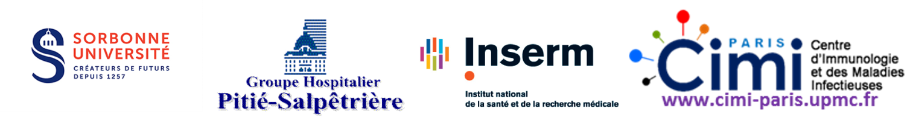

# UE genomique bacterienne (Avril 2021)
---

  

## Intervenants 
- Alexandra Aubry
- Alexandre Godmer
- Florence Morel

## Objectifs : 
- Place des outils moléculaires dans le diagnostic et la prise en charge des infections bactériennes
- Intérêt des outils moléculaires en bactériologie
- Limites des outils moléculaires en bactériologie
- Outils moléculaires en bactériologie : pour qui ? quand ? comment ?

**Programme :**
1. 14h-14h30 : Questions 	
2. 14h30-14h45 : Rappels sur le diagnostic conventionnel en bactériologie 	
3. 14h45-15h15 : Rappels concernant la génétique bactérienne	
*PAUSE*
4. 15h20-15h50 : Place des outils moléculaires dans le diagnostic et la prise en charge des infections bactériennes
5. 15h50-16h30 : Cas clinique interactif illustrant intérêt et limites des outils moléculaires en bactériologie	
6. 16h30-17h : Perspectives et outils d’avenir (métagénomique)		
7. 17h : A retenir ; place diagnostic conventionnel et outils moléculaires	

